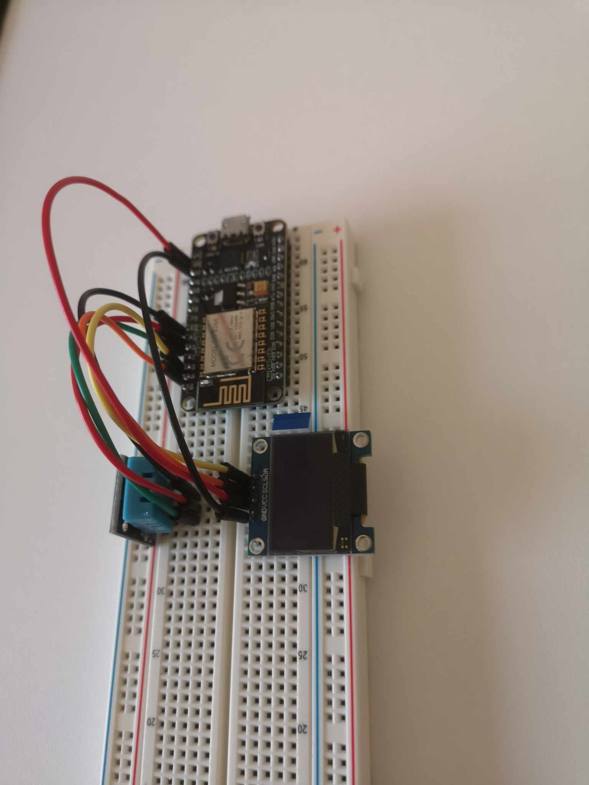
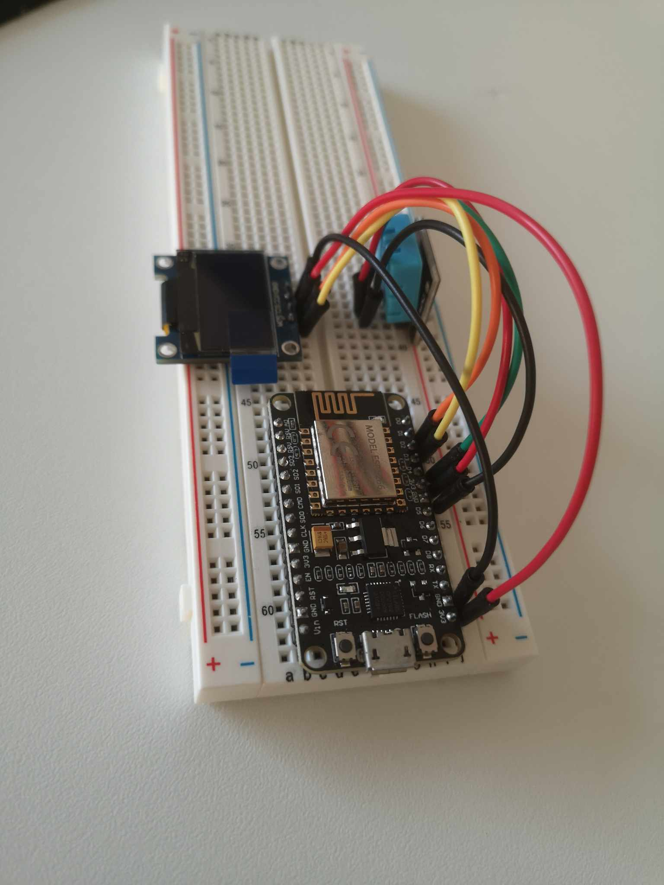

# Comment afficher la température avec un ESP8266 et un capteur DHT11

## Préparer l'Arduino IDE

Voir la vidéo <https://www.youtube.com/watch?v=lQm3YKkXPNc> et avec complémentaire cet article <https://randomnerdtutorials.com/how-to-install-esp8266-board-arduino-ide/>.

- Installer la source pour l'ESP - <http://arduino.esp8266.com/stable/package_esp8266com_index.json>
- Choisir le bon board - `NodeMCU 1.0 (ESP 12E Module)`
- Mettre les bonnes configurations

## Pour redémarrer le ESP8266

1. press and hold the reset button
2. press and hold the program button
3. release the reset button, the ESP will boot in program mode
4. release the program button
5. upload the sketch

<https://tttapa.github.io/ESP8266/Chap06%20-%20Uploading.html>

## Librairies

Il y a plusieurs librairies nécessaires, suffit de consulter les articles pour savoir lesquelles utiliser, mais voici certaines.

### DHT sensor library for ESPx

- Voici la documentation de la librairie : <https://desire.giesecke.tk/index.php/2018/01/30/esp32-dht11/>
- Nom pour le include : #include "DHTesp.h"

## Diagrammes

## Afficher dans la moniteur série les données du DHT11

Je me suis basé sur le projet <https://github.com/beegee-tokyo/DHTesp/blob/master/examples/DHT_ESP8266/DHT_ESP8266.ino> pour faire mon code.

> **Pour le code :** voir le projet `sketch_feb13a`.

## Afficher sur une écran OLED  les données du DHT11

Je me suis basé sur ce projet comme exemple <https://randomnerdtutorials.com/esp8266-0-96-inch-oled-display-with-arduino-ide/>.

> **Pour le code :** voir le projet `sketch_jul21a`.

## Envoyer dans Azure IoT Central les données du DHT11

Je me suis basé sur ce projet comme exemple <https://how2electronics.com/getting-started-with-azure-iot-central-using-esp8266/>.

> **Pour le code :** voir le projet `sketch_jul19a`.

> **Note :** C'est important que la version du board du ESP8266 soit à 2.7.4, sinon le code ne fonctionnera pas!
